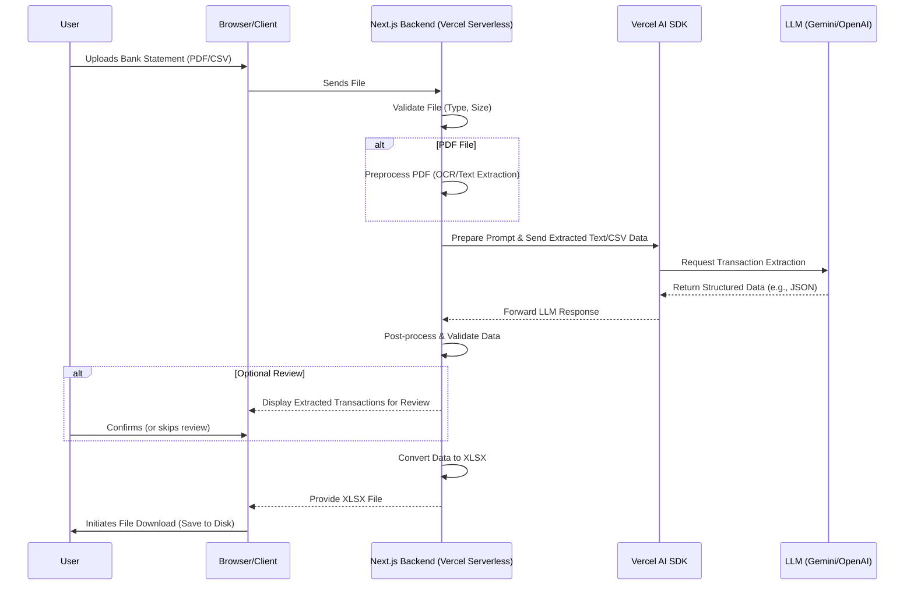

# Bank Statement Converter Application Specifications

## Overview

The Bank Statement Converter is a web application designed to help users extract transaction data from their bank statements and convert it into an Excel (XLSX) format. The application will feature user authentication, allowing users to sign up for different plans with varying usage limits. It will also include landing pages optimized for search engines (SEO) to attract new users.

## Features

### v1.0

- **File Upload:** Users can upload their bank statement files (e.g., PDF, CSV documents) through a user-friendly interface.
- **Data Extraction:** The application will parse the uploaded files to extract relevant transaction data, including dates, descriptions, amounts, and transaction types.
- **Data Export:** Users can export their transaction data into an Excel (XLSX) file.
- **Usage Tracking:** User can view how many pages they have consumed for that period.
- **Language Support:** The application will support multiple languages.
- **User Authentication:** Secure user sign-up and login functionality.
- **Subscription Plans:** Different subscription tiers with varying limits on file uploads or pages processed.
- **SEO-Optimized Landing Pages:** Informative and attractive landing pages to draw organic traffic.

### Future Versions (Potential Features)

- API support (users can access via API with API key)
- Export to other formats (e.g., CSV, JSON)

## Tech Stack

- Next.js with TypeScript
- Tailwind CSS and shadcn/ui for UI components
- Static Site Generation (SSG/SSR) for SEO and performance
- Vercel for deployment (Serverless Functions)
- Clerk for authentication and user management
- Stripe for payments (exploring Clerk Billing for recurring payments)
- LLM Providers: Gemini, OpenAI
- Vercel AI SDK for streaming UI updates and handling LLM requests

## Data Extraction Workflow

The core data extraction process will involve the following steps:

1.  **File Upload**: The user uploads a bank statement (PDF or CSV) through the application interface.
2.  **File Validation**: The system performs initial validation on the file (e.g., type, size).
3.  **Preprocessing (if PDF)**: If the file is a PDF, it may undergo an OCR (Optical Character Recognition) process if it's image-based, or direct text extraction if it's text-based.
4.  **LLM Interaction**: The extracted text (or CSV content) is sent to an LLM (either Gemini or OpenAI, potentially chosen based on cost, performance for the specific document type, or user preference) via the Vercel AI SDK.
5.  **Prompt Engineering**: A carefully crafted prompt guides the LLM to extract specific transaction details (date, description, amount, currency, type).
6.  **Data Structuring**: The LLM returns the extracted data, ideally in a structured format (e.g., JSON).
7.  **Post-processing & Validation**: The application parses the LLM's response, validates the data (e.g., date formats, numeric amounts), and handles any potential errors or ambiguities.
8.  **Data Display (Optional Review)**: The extracted and validated transactions can be displayed to the user for a final review before conversion.
9.  **XLSX Conversion & Download**: The application converts the structured transaction data into an XLSX file. This file is then automatically prepared and offered to the user for download to their local disk.

## Detailed UI/UX Page and Component Layout

This section provides a detailed plan for the layout and components of each page in the Bank Statement Converter application.

### I. Marketing Pages (Logged-out Users)

These pages share a common structure: `MainNavbar` at the top and a `Footer` at the bottom.

**1. Homepage (`/`)**

- **Overall Layout**: An interactive landing page designed for immediate engagement and conversion, followed by informational sections.
- **Components & Placement**:
  - **Top Authority Bar (Above Navbar)**:
    - Thin horizontal bar spanning the page width.
    - Content: Rotating snippets of positive reviews (e.g., "Rated 4.9/5 stars by X users"), logos of "As Seen On" publications (if applicable), or short text like "Trusted by 10,000+ Happy Users." This could utilize simple text or small `StatCard`-like elements.
  - **`MainNavbar` (Top - Below Authority Bar)**:
    - Left: Application Logo.
    - Center: Links to "Features", "Pricing", "About Us", "Contact".
    - Right: `LanguageSelector`, "Login" `SecondaryButton`, "Sign Up" `PrimaryButton`.
  - **Interactive Hero Section (Below Navbar)**:
    - Headline: Clear, action-oriented (e.g., "Convert Your Bank Statement to Excel - Instantly & Free").
    - Sub-headline: Briefly explains the immediate benefit (e.g., "Upload a PDF or CSV and see the magic. No account needed for a quick try!").
    - **Embedded File Upload & Conversion Module (Core of this section)**:
      - `FileUploadZone`: Prominent drag-and-drop area with clear instructions.
      - Alternative `FileInput` `PrimaryButton` ("Or Select File").
      - Text indicating supported file types (PDF, CSV) and perhaps a small note on a free trial limit (e.g., "Try with a 1-page statement").
      - `ProgressBar` (initially hidden) to show upload and processing progress.
      - **Post-Processing (Simulated/Limited for logged-out users)**:
        - If a file is processed successfully:
          - A brief, visually appealing display of _sample_ extracted data (e.g., the first 3-5 rows in a mini, read-only `DataTable`).
          - `PrimaryButton`: "Download Sample XLSX" or "Unlock Full File with Signup".
          - `SecondaryButton`: "Upload Another File" or "Clear".
        - If there's an issue: `ToastNotification` or inline error message.
      - This module aims to give a taste of the core functionality.
  - **"How It Works" Section (Below Interactive Hero)**:
    - Brief section title (e.g., "Simple 3-Step Process").
    - Three `Card` components arranged horizontally or vertically, each representing a step:
      1.  **Upload**: Icon (e.g., upload cloud), Title ("Upload Securely"), Short description.
      2.  **Convert**: Icon (e.g., gears, magic wand), Title ("AI-Powered Extraction"), Short description.
      3.  **Download**: Icon (e.g., download arrow), Title ("Get Your Excel File"), Short description.
  - **Key Features Section**:
    - Section title (e.g., "Why Choose Us?").
    - Grid of 3-6 `Card` components, each highlighting a key feature:
      - E.g., "Supports PDF & CSV", "Accurate Data Extraction", "Multi-Language", "Secure & Private", "Subscription Plans".
      - Each `Card` contains an icon, feature title, and brief description.
  - **Pricing Snippet/Teaser Section (Optional)**:
    - A brief mention of the pricing plans with a `PrimaryButton` "View Pricing Plans" linking to `/pricing`.
  - **Testimonials Section (Future, or use placeholders)**:
    - `Card`s to display user testimonials.
  - **FAQ Section**:
    - Section title (e.g., "Frequently Asked Questions").
    - Uses accordion-style UI (e.g., shadcn/ui Accordion) for Q&A pairs.
    - Example Questions:
      - "Is my data secure when I upload it?"
      - "What file formats can I convert?"
      - "Do I need to create an account to try it?"
      - "How accurate is the data extraction?"
      - "What are the limitations of the free try?"
  - **Final Call to Action (CTA) Section**:
    - Headline reinforcing the main benefit.
    - `PrimaryButton` (e.g., "Sign Up Now").
  - **`Footer` (Bottom)**:
    - Copyright, links to "Terms of Service", "Privacy Policy", "Contact Us".
    - Optional: Social media icons (`IconButton`s).

**2. Features Page (`/features`) [DEFERRED FOR NOW]**

**3. Pricing Page (`/pricing`)**

- **Overall Layout**: Clear comparison of subscription tiers.
- **Components & Placement**:
  - **`MainNavbar` (Top)**
  - **Page Header Section**:
    - Main title (e.g., "Choose the Plan That's Right For You").
    - `ToggleSwitch` or `ButtonGroup` for "Monthly" / "Annual (Save 40%)" pricing views.
  - **Pricing Tiers Section**:
    - Three `Card` components arranged horizontally, each representing a subscription plan:
      - **Free Plan Card**:
        - Plan Name: "Free"
        - Price: "$0/month"
        - Description: "Perfect for quick, occasional conversions."
        - Features/Limits: "1 page per day", "PDF & CSV support", "Basic Features".
        - `PrimaryButton`: "Get Started".
      - **"Growth" Plan Card**:
        - Plan Name: "Growth"
        - Price: "$13.33/month" (or "$8/month, billed annually at $96/year")
        - Description: "Ideal for regular individual use."
        - Features/Limits: "500 pages/month", "All Free features", "Priority Email Support".
        - `PrimaryButton`: "Choose Growth".
      - **"Premium" Plan Card**:
        - Plan Name: "Premium"
        - Price: "$23.33/month" (or "$14/month, billed annually at $168/year")
        - Description: "Best for power users and small businesses."
        - Features/Limits: "1000 pages/month", "All Basic features", "Advanced Features (e.g., API access - future)", "Dedicated Support".
        - `PrimaryButton`: "Choose Premium".
    - One plan (e.g., "Growth") could be highlighted as "Most Popular".
  - **Features Comparison Table (Optional but Recommended)**:
    - A `DataTable`-like structure (can be a simple HTML table) comparing features across all plans in detail. Rows for features, columns for plans, with checkmarks or specific limits.
  - **FAQ Section**:
    - Accordion-style Q&A for common pricing questions (e.g., "Can I cancel anytime?", "What payment methods are accepted?", "How does the annual discount work?").
  - **`Footer` (Bottom)**

**4. About Us Page (`/about`)**

- **Overall Layout**: Narrative page about the company/project.
- **Components & Placement**:
  - **`MainNavbar` (Top)**
  - **Page Header Section**:
    - Main title (e.g., "Our Story" or "About [App Name]").
  - **Mission/Vision Section**:
    - Paragraphs describing the purpose and goals.
  - **Team Section (Optional)**:
    - `Card`s for team members with photos, names, and roles.
  - **Contact Snippet**:
    - A brief invitation to get in touch, with a `SecondaryButton` linking to `/contact`.
  - **`Footer` (Bottom)**

**5. Contact Page (`/contact`)**

- **Overall Layout**: Provides means for users to get in touch.
- **Components & Placement**:
  - **`MainNavbar` (Top)**
  - **Page Header Section**:
    - Main title (e.g., "Get In Touch" or "Contact Support").
    - Brief introductory text.
  - **Contact Form Section**:
    - `InputField` for Name.
    - `InputField` for Email (type: email).
    - `SelectDropdown` for Subject/Inquiry Type (optional).
    - `Textarea` for Message.
    - `PrimaryButton` for "Send Message".
    - `ToastNotification` for form submission success/error.
  - **Alternative Contact Methods Section (Optional)**:
    - Email address, phone number (if applicable).
    - Links to social media profiles.
  - **`Footer` (Bottom)**

---

### II. Authentication Pages (Handled Primarily by Clerk.dev)

These pages will largely use Clerk's pre-built components, styled to match the application's theme.

**6. Login Page (`/sign-in`)**
**7. Signup Page (`/sign-up`)**
**8. Forgot Password Page (`/forgot-password`)**

- **Overall Layout**: Centered authentication form.
- **Components & Placement**:
  - Minimal `MainNavbar` (Logo, perhaps a "Back to Home" link).
  - Clerk's `<SignIn />`, `<SignUp />`, or password reset components.
    - These components will handle all form fields, validation, and actions.
    - Ensure Clerk components are configured to use app's branding/styling as much as possible.
  - Minimal `Footer` (Copyright, links to Terms/Privacy).

---

### III. Application Pages (Logged-in Users)

These pages share a common `UserNavbar` at the top, providing consistent navigation and user-specific controls.

**9. Dashboard (`/dashboard`)**

- **Overall Layout**: Main workspace for file conversion, below the `UserNavbar`.
- **Components & Placement**:
  - **`UserNavbar` (Top - Shared across authenticated pages)**:
    - Left: Application Logo.
    - Center (or right of logo): Navigation Links (e.g., "Convert/Dashboard", "Settings", "Billing" - if separate).
    - Right: `UsageTracker` (e.g., "Credits: 450/500"), `LanguageSelector`, User Avatar/Profile `IconButton` (dropdown with link to "Settings" and "Logout").
  - **Main Content Area (Below `UserNavbar`)**:
    - Main Page Title (e.g., `<h1>Bank Statement Converter</h1>`)
    - **File Upload Module (Prominent Top Section)**:
      - Headline (e.g., "Upload Your Bank Statement").
      - `FileUploadZone`: Drag-and-drop area with icon and text (e.g., "Drag & drop PDF or CSV here, or click to select").
      - Alternative `FileInput` `PrimaryButton` ("Or Select File").
      - Text indicating supported file types (PDF, CSV) and max file size.
      - `ProgressBar` (initially hidden) to show upload and processing progress.
      - **Post-Processing (Simulated/Limited for logged-out users)**:
        - If a file is processed successfully:
          - A brief, visually appealing display of _sample_ extracted data (e.g., the first 3-5 rows in a mini, read-only `DataTable`).
          - `PrimaryButton`: "Download Sample XLSX" or "Unlock Full File with Signup".
          - `SecondaryButton`: "Upload Another File" or "Clear".
        - If there's an issue: `ToastNotification` or inline error message.
      - This module aims to give a taste of the core functionality.
    - `ToastNotification` area for system messages (e.g., "File uploaded successfully", "Extraction complete", "Error: Invalid file type").

**10. User Profile & Settings (`/dashboard/settings`)**

- **Overall Layout**: Tabbed interface for managing user-specific information, below the `UserNavbar`.
- **Components & Placement**:
  - **`UserNavbar` (Top - Shared across authenticated pages)**: (Same as above)
  - **Main Content Area (Below `UserNavbar`, Tabbed Navigation)**:
    - Main Page Title (e.g., `<h1>Settings</h1>`)
    - Tabs: "Profile", "Subscription & Billing", "Security" (if needed beyond Clerk).
    - **Profile Tab**:
      - Clerk's `<UserProfile />` component can handle most of this (avatar, name, email management).
      - Consider if `LanguageSelector` needs to be duplicated here if user preference is stored vs. session-based in Navbar.
    - **Subscription & Billing Tab**:
      - Current Plan Display: `Card` showing current plan name, key limits (e.g., "Pro Plan - 500 pages/month").
      - Usage Display: `StatCard`s or `ProgressBar` for "Current Period Page Usage".
      - `PrimaryButton` "Manage Subscription" or "Upgrade Plan" - this would likely link to a Stripe customer portal or trigger a Clerk Billing flow.
      - Billing History (if available): `DataTable` showing past invoices (date, amount, status, download link).
    - **Security Tab**:
      - Clerk's `<UserProfile />` component often includes password change functionality.
      - If Two-Factor Authentication (2FA) is offered via Clerk, relevant settings here.
    - `ToastNotification` for successful updates.

---

### IV. Legal Pages

Simple, text-focused pages.

**11. Terms of Service (`/terms-of-service`)**
**12. Privacy Policy (`/privacy-policy`)**

- **Overall Layout**: Standard legal document presentation.
- **Components & Placement**:
  - **`MainNavbar` (Top, if accessed by logged-out users) or Minimal Header (if accessed from within app footer)**.
  - **Page Title**.
  - **Main Content**: Formatted text content of the policy. Use clear headings, paragraphs, and lists.
  - **`Footer` (Bottom)**.

---

This detailed plan should provide a clear blueprint for developing the UI.

## Implementation Plan

This plan outlines the development phases, starting with frontend UI and mock data, then progressing to backend logic and third-party integrations.

**Phase 1: Frontend Development (UI/UX with Mock Data & Initial Auth)**

1.  **[x] Project Setup:**
    - [x] Initialize Next.js project with TypeScript.
    - [x] Set up Tailwind CSS and shadcn/ui.
    - [x] Configure basic project structure (app, components, lib, etc.).
2.  **[x] Landing Pages (Static):**
    - [x] Develop static, SEO-focused landing pages: Homepage, Features, Pricing, About Us, Contact.
3.  **[x] Authentication UI (Clerk Dev Integration):**
    - [x] Integrate Clerk development components for Login, Signup, Forgot Password pages.
    - [x] Set up basic client-side authentication flows using Clerk.
4.  **[ ] Dashboard & Core App UI (Mock Data):**
    - [x] Design and implement the main dashboard layout.
    - [ ] **File Upload UI:** Interface for selecting and uploading files.
    - [ ] **Transaction Display UI:** Table to display extracted transactions (using mock data).
    - [ ] **Export UI:** Button to trigger mock data export.
    - [ ] **Usage Tracking UI:** Display for consumed pages (mock data).
5.  **[ ] User Profile/Settings UI (Mock & Basic Clerk):**
    - [ ] UI for managing profile settings (e.g., change password - leveraging Clerk where possible).
    - [ ] UI for viewing current subscription plan and (mock) upgrade options.
6.  **[ ] Language Support UI (Initial Setup):**
    - [ ] Basic UI elements for language selection.
    - [ ] Set up i18n (e.g., `next-i18next`) with placeholder translations for UI text.
7.  **[ ] Responsive Design & Basic Accessibility:**
    - [ ] Ensure all UI is responsive across common device sizes.
    - [ ] Perform initial accessibility checks.

**Phase 2: Backend Development & Core Logic (Next.js API Routes)**

1.  **[ ] API Route Structure:**
    - [ ] Set up API routes for file upload, data extraction, and XLSX download.
2.  **[ ] File Handling:**
    - [ ] Implement server-side logic for receiving and temporarily processing uploaded files (PDF, CSV).
    - [ ] Implement initial file validation (type, size).
3.  **[ ] Mock Extraction Service:**
    - [ ] Create a backend service that simulates LLM data extraction, returning structured JSON transaction data based on uploaded file type (for testing UI flow without actual LLM calls).
4.  **[ ] XLSX Generation & Download:**
    - [ ] Implement logic to convert structured JSON transaction data into an XLSX file (e.g., using `exceljs` or `xlsx` library).
    - [ ] Create the API endpoint to trigger XLSX file download.

**Phase 3: Third-Party Integrations & Backend Finalization**

1.  **[ ] Clerk Integration (Advanced & Backend):**
    - [ ] Secure API routes and dashboard pages based on Clerk authentication state.
    - [ ] Implement full user profile data management via Clerk (e.g., linking user metadata if needed).
    - [ ] Ensure seamless user session management across frontend and backend.
2.  **[ ] LLM Integration (Gemini/OpenAI via Vercel AI SDK):**
    - [ ] Set up and configure the Vercel AI SDK.
    - [ ] Implement API calls to chosen LLM provider(s) (Gemini, OpenAI) for actual transaction data extraction.
    - [ ] Develop and refine prompts for optimal extraction accuracy.
    - [ ] Handle LLM API responses, including potential errors and rate limits.
    - [ ] Replace the mock extraction service with live LLM calls.
3.  **[ ] PDF Preprocessing (if necessary):**
    - [ ] If LLMs struggle with certain PDF types, integrate a PDF parsing/OCR library (e.g., `pdf-parse` for text-based PDFs, or explore cloud OCR if image-based PDFs are common).
4.  **[ ] Stripe Integration (Payments & Subscriptions):**
    - [ ] Set up Stripe account, products (subscription plans), and prices.
    - [ ] Integrate Stripe Checkout or Payment Elements for users to subscribe to plans.
    - [ ] Implement Stripe webhooks to handle subscription events (e.g., `checkout.session.completed`, `customer.subscription.updated`, `invoice.payment_succeeded`).
    - [ ] Link subscription status (from Stripe, associated with Clerk user ID) to feature access/limits (e.g., page consumption).
    - [ ] (Optional) Evaluate and integrate Clerk Billing if it simplifies subscription management with Stripe.
5.  **[ ] Language Support (Content Finalization):**
    - [ ] Add actual translations for all supported languages to the i18n resource files.

**Phase 4: Testing, Refinement & Deployment**

1.  **[ ] End-to-End Testing:**
    - [ ] Thoroughly test the entire user workflow: signup -> login -> file upload -> data extraction -> (optional review) -> XLSX download.
    - [ ] Test subscription purchase and management flows.
    - [ ] Test different file types and edge cases for extraction.
2.  **[ ] Error Handling & Logging:**
    - [ ] Implement robust error handling on both frontend and backend.
    - [ ] Utilize Vercel's logging for server-side issues.
3.  **[ ] Performance Optimization:**
    - [ ] Analyze and optimize Next.js build sizes, page load times, and API response times.
    - [ ] Image optimization for landing pages.
4.  **[ ] Security Hardening:**
    - [ ] Review for common web vulnerabilities (XSS, CSRF, etc.).
    - [ ] Ensure proper handling of API keys and sensitive data (environment variables).
5.  **[ ] SEO Finalization:**
    - [ ] Verify meta tags, structured data, sitemap.xml, and robots.txt for landing pages.
6.  **[ ] Vercel Deployment Configuration:**
    - [ ] Configure production environment variables on Vercel.
    - [ ] Set up custom domain(s).
7.  **[ ] Pre-launch Checklist & Go-Live.**
