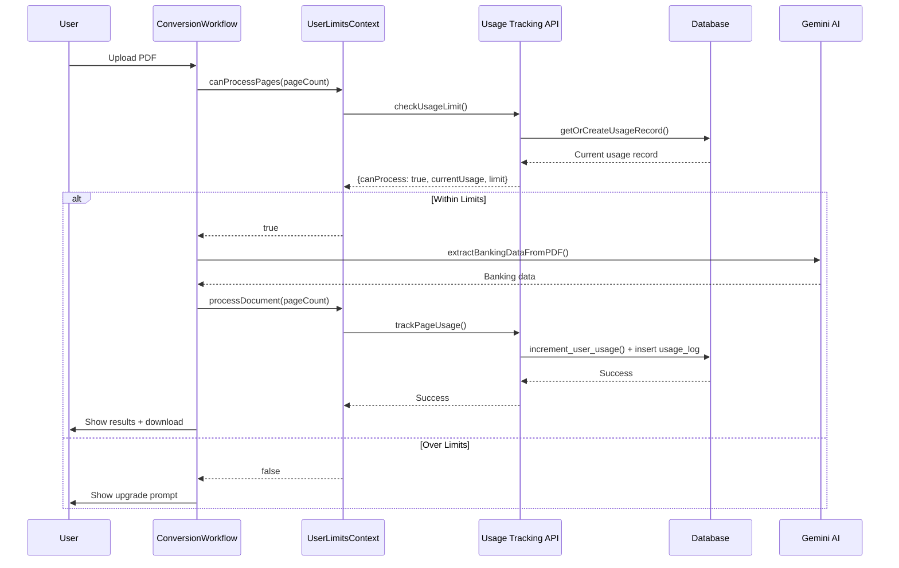
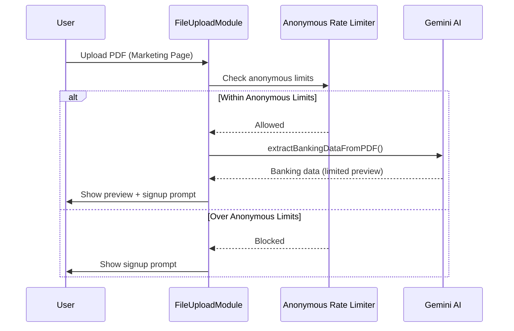

# Page Count Usage Tracking Flow Documentation

## Overview

The Bank Statement Convert implements a comprehensive usage tracking system that monitors and limits user document processing based on page consumption. The system supports both anonymous users (marketing flow) and authenticated users (viewer flow) with different plan tiers and limits.

## Architecture

### Database Schema

The usage tracking system uses a two-table design:

#### 1. `user_usage` Table

**Purpose**: Tracks monthly page consumption per user aligned with billing periods

```sql
CREATE TABLE user_usage (
  id UUID DEFAULT gen_random_uuid() PRIMARY KEY,
  user_id TEXT NOT NULL,                          -- Clerk user ID
  billing_period_start DATE NOT NULL,             -- Start of billing cycle
  billing_period_end DATE NOT NULL,               -- End of billing cycle
  pages_consumed INTEGER DEFAULT 0,               -- Pages used in this period
  plan_type TEXT DEFAULT 'free',                  -- User's subscription plan
  created_at TIMESTAMP WITH TIME ZONE DEFAULT NOW(),
  updated_at TIMESTAMP WITH TIME ZONE DEFAULT NOW(),

  CONSTRAINT unique_user_billing_period UNIQUE(user_id, billing_period_start)
);
```

**Key Features**:

- One record per user per billing period
- Automatic `updated_at` handling via `moddatetime` extension
- Check constraints ensure data integrity
- Indexed for performance on user queries

#### 2. `usage_logs` Table

**Purpose**: Immutable audit trail of all file processing activities

```sql
CREATE TABLE usage_logs (
  id UUID DEFAULT gen_random_uuid() PRIMARY KEY,
  user_id TEXT NOT NULL,                          -- Clerk user ID
  pages_processed INTEGER NOT NULL,               -- Pages in this processing event
  file_name TEXT,                                 -- Original filename (optional)
  file_size INTEGER,                              -- File size in bytes (optional)
  created_at TIMESTAMP WITH TIME ZONE DEFAULT NOW(),
  updated_at TIMESTAMP WITH TIME ZONE DEFAULT NOW()
);
```

**Key Features**:

- Immutable log entries (INSERT and SELECT only via RLS)
- Tracks individual processing events with metadata
- Enables usage analytics and debugging

#### 3. Helper Functions

**Atomic Usage Updates**: `increment_user_usage()` function ensures race-condition-free updates:

```sql
CREATE OR REPLACE FUNCTION increment_user_usage(
  usage_id UUID,
  increment_by INTEGER
)
RETURNS void AS $$
BEGIN
  UPDATE user_usage
  SET pages_consumed = pages_consumed + increment_by
  WHERE id = usage_id;

  IF NOT FOUND THEN
    RAISE EXCEPTION 'Usage record with ID % not found', usage_id;
  END IF;
END;
$$ LANGUAGE plpgsql;
```

## Plan Structure and Limits

The system supports three subscription tiers:

```typescript
export const PLAN_LIMITS = {
  free: 50, // 50 pages per billing period
  paid1: 500, // 500 pages per month
  paid2: 1000, // 1000 pages per month
} as const
```

### Plan Characteristics:

- **Free Plan**: 50 pages per billing period, no recurring payments
- **Paid1 Plan (Growth)**: 500 pages per month, $8/month (billed annually)
- **Paid2 Plan (Premium)**: 1000 pages per month, $15/month (billed annually)

## Billing Period Calculation

The system implements sophisticated billing period calculation that handles:

### Key Features:

1. **Date Clamping**: Handles months with different day counts (Feb 28/29, months with 30/31 days)
2. **Subscription Start Date Alignment**: Billing periods align with user's subscription start date
3. **UTC Consistency**: All date calculations use UTC to avoid timezone issues

### Algorithm:

```typescript
export function calculateBillingPeriod(subscriptionStartDate: Date): {
  periodStart: string
  periodEnd: string
} {
  // 1. Determine current billing cycle based on subscription start day
  // 2. Clamp start day to maximum available days in target month
  // 3. Calculate period end as day before next period starts
  // 4. Return ISO date strings (YYYY-MM-DD format)
}
```

### Example Scenarios:

- Subscription starts Jan 31st → Feb billing period starts Feb 28th (29th in leap years)
- Subscription starts Jan 15th → All periods start on 15th of each month
- Edge case handling for leap years and month boundaries

## Core Usage Tracking Functions

### 1. `getOrCreateUsageRecord()`

**Purpose**: Ensures a usage record exists for the current billing period

```typescript
const usageRecord = await getOrCreateUsageRecord(
  userId: string,
  planType: PlanType = "free",
  subscriptionStartDate?: Date
)
```

**Logic**:

1. Calculate current billing period
2. Try to fetch existing record for user + period
3. Create new record if none exists
4. Return usage record with current consumption

### 2. `checkUsageLimit()`

**Purpose**: Pre-flight check to determine if user can process additional pages

```typescript
const result = await checkUsageLimit(
  userId: string,
  additionalPages: number,
  planType: PlanType = "free",
  subscriptionStartDate?: Date
)

// Returns:
{
  canProcess: boolean,      // Whether user can process these pages
  currentUsage: number,     // Current page consumption
  limit: number,           // Plan limit
  wouldExceed: boolean     // Whether this would exceed limit
}
```

**Validation**:

- Rejects non-positive integers
- Rejects decimal numbers, NaN, Infinity
- Provides detailed error messages

### 3. `trackPageUsage()`

**Purpose**: Records actual page consumption after successful processing

```typescript
await trackPageUsage(
  userId: string,
  pagesProcessed: number,
  fileName?: string,
  fileSize?: number,
  planType: PlanType = "free",
  subscriptionStartDate?: Date
)
```

**Process**:

1. Get/create usage record for current period
2. Atomically increment page count using `increment_user_usage()` RPC
3. Create audit log entry in `usage_logs` table
4. Handle errors gracefully (usage update is critical, logging is not)

### 4. `getUserUsage()`

**Purpose**: Retrieves comprehensive usage data for display

```typescript
const usageData: UsageData = await getUserUsage(userId, planType, subscriptionStartDate)

// Returns:
{
  currentPeriodUsage: number,    // Pages used this period
  planLimit: number,             // Plan's page limit
  planType: PlanType,            // User's plan type
  billingPeriodStart: string,    // Period start date (ISO)
  billingPeriodEnd: string,      // Period end date (ISO)
  remainingPages: number,        // Pages remaining
  usagePercentage: number        // Usage as percentage (0-100)
}
```

### 5. `updateUserPlan()`

**Purpose**: Updates user's subscription plan in the database

```typescript
await updateUserPlan(
  userId: string,
  newPlanType: PlanType,
  subscriptionStartDate?: Date
)
```

**Process**:

1. Validates user ID and plan type parameters
2. Calculates current billing period
3. Updates `plan_type` field for current usage record
4. Ensures future usage records will use the new plan type

**Validation**:

- Rejects empty user IDs
- Validates plan type against allowed values ('free', 'paid1', 'paid2')
- Provides detailed error messages for invalid inputs

### 6. `getUserPlan()`

**Purpose**: Retrieves user's current plan from database

```typescript
const currentPlan: PlanType = await getUserPlan(
  userId: string,
  subscriptionStartDate?: Date
)
```

**Process**:

1. Gets or creates usage record for current billing period
2. Returns the `plan_type` from the database record
3. Provides authoritative plan data source

## File Processing Integration

### PDF Page Counting

The system uses `pdf-parse` library for accurate page counting:

```typescript
// lib/upload/pdf-utils.ts
export async function countPdfPages(fileBuffer: Buffer): Promise<number> {
  const data = await pdf(fileBuffer)
  return data.numpages
}

export async function getPdfMetadata(fileBuffer: Buffer): Promise<{
  pageCount: number
  text: string
  title?: string
  author?: string
  creationDate?: string
}> {
  // Returns comprehensive PDF metadata including page count
}
```

### AI Processing Integration

The transaction extraction process integrates with usage tracking:

```typescript
// lib/ai/transactions-extractor.ts
export async function extractBankingDataFromPDF(file: File): Promise<LLMProcessingResult> {
  // 1. Convert PDF to base64
  // 2. Send to Gemini AI for transaction extraction
  // 3. Validate and structure response
  // 4. Return banking data (page count handled separately)
}
```

**Note**: Page counting is handled independently of AI processing to ensure accurate usage tracking regardless of AI processing success/failure.

## User Interface Integration

### Anonymous Users (Marketing Flow)

**File**: `components/marketing/FileUploadModule.tsx`

**Process**:

1. User uploads PDF on marketing pages
2. PDF page count determined via `getPdfMetadata()`
3. Anonymous usage limits checked (separate from authenticated flow)
4. AI processing occurs if within limits
5. Preview data shown with signup prompts for full access

**Rate Limiting**: Anonymous users have separate rate limiting (not tracked in database)

### Authenticated Users (Viewer Flow)

**File**: `components/viewer/ConversionWorkflow.tsx`

**Process**:

1. User uploads PDF on viewer page
2. Check usage limits via `checkUsageLimit()` before processing
3. If within limits, process PDF and extract transactions
4. Track usage via `trackPageUsage()` after successful processing
5. Display results with download functionality

**Error Handling**:

- Limit exceeded → Show upgrade prompt
- Processing failed → Don't count against usage
- Usage tracking failed → Log warning but don't block user

### Context Management

**File**: `contexts/user-limits-context.tsx`

The `UserLimitsProvider` manages user state and limits:

```typescript
interface UserLimitsData {
  userType: UserType // anonymous | free | paid
  subscriptionPlan: SubscriptionPlan // free | paid1 | paid2
  currentUsage: number // Pages used this period
  limit: number // Plan limit
  usagePercentage: number // Usage percentage
  isAtLimit: boolean // At/over limit
  isNearLimit: boolean // >= 75% usage
  isCritical: boolean // >= 90% usage
  resetDate?: string // Next billing cycle
  isMonthlyLimit: boolean // Monthly vs lifetime limit
  planName: string // Plan display name
  planPrice: string // Plan price
}
```

**Key Methods**:

- `canProcessPages(pages: number)`: Pre-flight limit check
- `processDocument(pageCount: number)`: Process with usage tracking
- `getRemainingPages()`: Calculate remaining quota
- `getUpgradePromptVariant()`: Determine UI prompt urgency

## Usage Flow Diagrams

### Authenticated User Flow



### Anonymous User Flow



## Error Handling and Edge Cases

### Database Errors

- **Connection failures**: Graceful fallback with user-friendly messages
- **Constraint violations**: Automatic retry with exponential backoff
- **RPC function errors**: Detailed logging with context

### Usage Tracking Errors

- **Pre-processing limit check fails**: Block processing, show error
- **Post-processing tracking fails**: Log warning, don't block user experience
- **Invalid page counts**: Reject with validation errors

### Billing Period Edge Cases

- **Leap years**: Handled automatically by date clamping
- **Month boundaries**: Subscription dates properly adjusted
- **Timezone issues**: All calculations in UTC

### Plan Changes

**Implementation**: Plan changes are now fully implemented with database persistence:

- **Plan Updates**: `updateUserSubscriptionPlan()` server action updates `plan_type` in database
- **Current Plan Retrieval**: `getUserCurrentPlan()` server action gets authoritative plan from database
- **Context Integration**: `UserLimitsProvider.subscribeToPlan()` calls server actions and refreshes state
- **Mid-period upgrades**: New limits apply immediately with database update
- **Mid-period downgrades**: Existing usage grandfathered until next period
- **Subscription cancellation**: Revert to free plan limits via `updateUserPlan("free")`

**Usage Flow**:

1. User clicks pricing page button
2. Context calls `updateUserSubscriptionPlan()` server action
3. Server action updates database via `updateUserPlan()`
4. Context refreshes state with new plan limits
5. All future usage checks use new plan type from database

## Security Considerations

### Row Level Security (RLS)

```sql
-- user_usage table
CREATE POLICY "Allow anonymous access" ON user_usage
  FOR ALL TO anon USING (true);

-- usage_logs table
CREATE POLICY "Allow anonymous insert" ON usage_logs
  FOR INSERT TO anon WITH CHECK (true);
CREATE POLICY "Allow anonymous select" ON usage_logs
  FOR SELECT TO anon USING (true);
```

**Note**: Current implementation allows anonymous access for development. Production should implement user-specific policies based on Clerk authentication.

### API Security

- All usage functions validate input parameters
- Atomic operations prevent race conditions
- Comprehensive logging for audit trails
- Error messages don't expose sensitive data

## Monitoring and Analytics

### Usage Metrics Available

1. **Per-user usage**: Current period consumption and limits
2. **Usage history**: Individual processing events with metadata
3. **Plan utilization**: Usage patterns across different plans
4. **Processing success rates**: AI extraction success vs failures

### Debugging Features

- Comprehensive logging with structured data
- Date validation for billing period calculations
- Input validation with descriptive error messages
- Audit trail for all usage events

## Testing

### Test Coverage

**File**: `tests/lib/usage/tracking.test.ts`

- Input validation for all public functions
- Error handling for edge cases
- Return value structure validation
- Mock database interactions

**File**: `tests/lib/upload/pdf-utils.test.ts`

- PDF page counting accuracy
- Error handling for corrupted files
- Metadata extraction completeness

### Test Scenarios

- Valid positive integer page counts
- Invalid inputs (negative, decimal, NaN, Infinity)
- Database connection failures
- RPC function errors
- Billing period calculations across month boundaries

## Future Enhancements

### Planned Improvements

1. **Real Stripe Integration**: Replace mock subscription management
2. **Enhanced RLS**: User-specific database policies
3. **Usage Analytics Dashboard**: Admin interface for monitoring
4. **API Rate Limiting**: Request-level throttling
5. **Webhook Processing**: Real-time subscription updates

### Scalability Considerations

1. **Database Partitioning**: Partition usage tables by date ranges
2. **Caching**: Redis cache for frequently accessed usage data
3. **Background Processing**: Async usage tracking for high-volume scenarios
4. **Multi-tenant Architecture**: Separate usage tracking per organization

## Configuration

### Environment Variables

```bash
# Supabase Configuration (Server-only)
SUPABASE_URL=your_supabase_url
SUPABASE_ANON_KEY=your_anon_key

# Clerk Authentication
NEXT_PUBLIC_CLERK_PUBLISHABLE_KEY=your_clerk_key
CLERK_SECRET_KEY=your_clerk_secret

# AI Processing
GEMINI_API_KEY=your_gemini_api_key
```

**Important**: Supabase credentials are server-only environment variables (no `NEXT_PUBLIC_` prefix) to ensure database access is restricted to server-side code only. All database operations are performed via server actions to maintain security.

### Server Actions Architecture

The application uses a secure server-only architecture for database operations:

#### Core Layer (`lib/usage/tracking.ts`)

- Contains business logic functions that interact with Supabase
- Uses `createServerSupabaseClient()` with server-only environment variables
- Never exposed to client-side code

#### Server Actions Layer (`lib/usage/actions.ts`)

- Provides secure API endpoints using Next.js Server Actions
- Handles authentication via Clerk `auth()`
- Wraps core functions with error handling and validation
- Client components call these server actions

#### Client Layer

- `UserLimitsProvider` context calls server actions to get/update usage data
- UI components use the context for usage information
- No direct database access from client-side code

This architecture ensures:

- ✅ Database credentials never exposed to client
- ✅ All database operations require authentication
- ✅ Type-safe server-client communication
- ✅ Centralized error handling and validation

### Plan Configuration

Plans and limits are defined in `

/\*\*

- Server action to get user usage history
- Called from settings/analytics pages
  \*/
  export async function getUserUsageHistoryData(limit: number = 10): Promise<{
  success: boolean
  data?: Array<{
  id: string
  pages_processed: number
  file_name: string | null
  file_size: number | null
  created_at: string
  }>
  error?: string
  }> {
  try {
  const { userId } = await auth()

      if (!userId) {
        return {
          success: false,
          error: "User not authenticated",
        }
      }

      const history = await getUserUsageHistory(userId, limit)

      return {
        success: true,
        data: history,
      }

  } catch (error) {
  logger.error({ error, limit }, "Error getting user usage history")
  return {
  success: false,
  error: "Failed to get usage history",
  }
  }
  }

/\*\*

- Server action to update user's subscription plan (mock implementation)
- Called when user clicks pricing page buttons
  \*/
  export async function updateUserSubscriptionPlan(newPlanType: PlanType): Promise<{
  success: boolean
  error?: string
  }> {
  // Handles authentication, validation, and calls updateUserPlan()
  // Provides secure API for plan updates from client components
  }

/\*\*

- Server action to get user's current plan from database
- Called from context to get authoritative plan data
  \*/
  export async function getUserCurrentPlan(): Promise<{
  success: boolean
  data?: PlanType
  error?: string
  }> {
  // Handles authentication and calls getUserPlan()
  // Returns current plan type from database
  }
